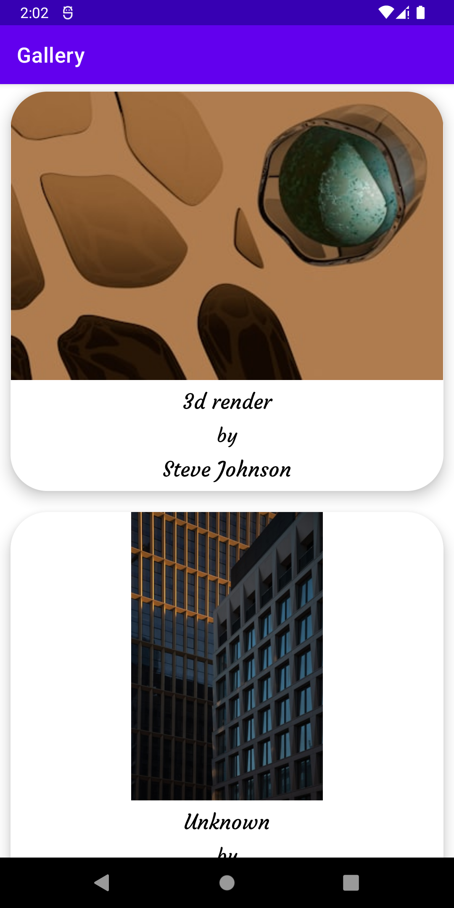
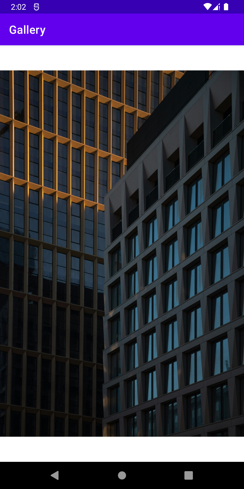

# Unsplash Gallery

Unsplash Gallery is an Android app that turns your device into a gallery of random photos. 
Easily browse and organize a small collection of images, each with a brief description. 
Perfect for those who enjoy discovering and viewing a variety of pictures in a simple and convenient way.

## Technologies used

- AndroidX Navigation
- Retrofit
- Coroutines
- LiveData
- Paging
- ViewModel

## Application

### Main Screen

### Detail Screen

